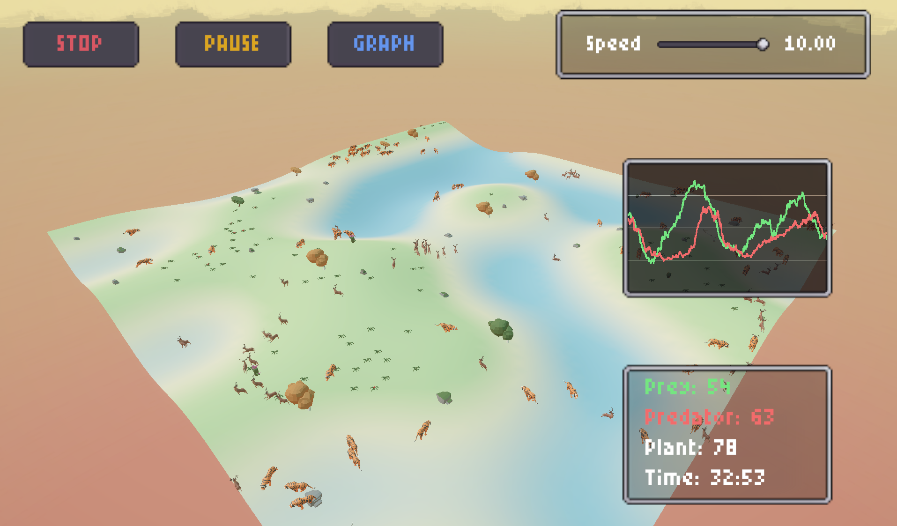
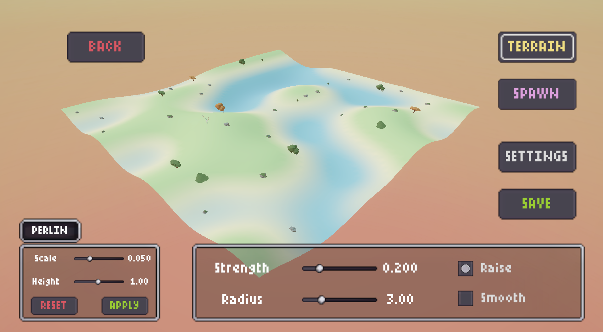
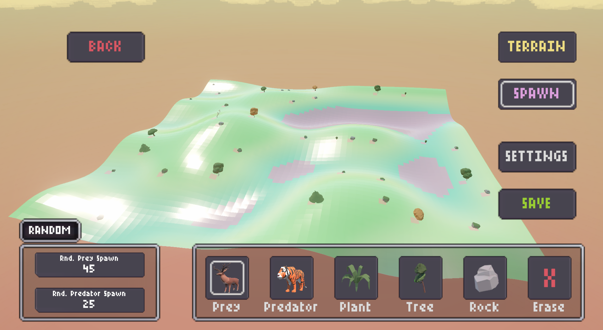
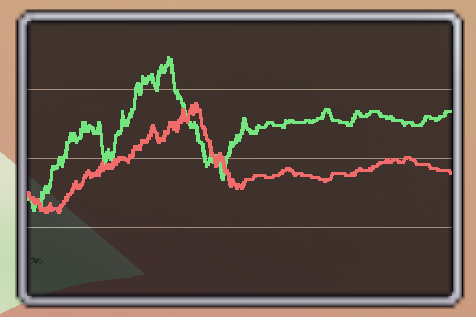

# Ecosystem Simulator

Sandbox di **simulazione evolutiva** predatore–preda in Unity: prede e predatori
vivono di energia, ereditano geni e si evolvono per **selezione naturale**, facendo
emergere strategie di sopravvivenza mai programmate esplicitamente.



---

## Introduzione

Ogni animale è un agente autonomo con un **genoma** (velocità, raggio di percezione,
socialità) e un **bilancio energetico**: si muove, cerca cibo, fugge o caccia in base a
ciò che percepisce, pesato dai propri geni. Solo chi sopravvive abbastanza da riprodursi
tramanda i propri geni, quindi le popolazioni si adattano da sole all'ambiente. L'utente
costruisce l'ambiente (mappe), ne regola i parametri e osserva l'ecosistema evolvere.

## Caratteristiche

- **Editor di mappe** — modella il terreno con generazione procedurale **Perlin** o a
  pennello, dipingi la **fertilità**, piazza animali, piante e ostacoli.
- **Evoluzione genetica** — 3 geni ereditabili con mutazione; nessuna strategia scriptata.
- **Ecologia auto-stabilizzante** — prede, predatori e piante in equilibrio dinamico:
  oscillazioni di popolazione persistenti senza estinzioni forzate.
- **Comportamenti emergenti** — branchi, dispersione, migrazioni verso zone fertili.
- **Camera Free / Follow / POV** — orbita libera, insegui un animale, o entra nella sua
  visuale in prima persona.
- **Analisi dati** — grafico delle popolazioni in tempo reale ed esportazione **log CSV**.
- **Parametri per-mappa** — energia, riproduzione, mutazione e altro, salvati con la mappa.

## Screenshot

| Terrain Tool | Spawn Tool |
|---|---|
|  |  |

| Grafico popolazioni
|---|
|  |

## Come funziona

Gli agenti non seguono regole demografiche globali: la popolazione **emerge** dalle
interazioni locali. Il movimento usa uno steering in stile *boids* (wander, coesione,
allineamento, separazione) combinato con fuga/inseguimento ed evitamento di acqua e bordi.
L'alimentazione delle prede dipende dalle piante, che crescono in modo logistico guidate
dalla fertilità del terreno. La predazione include tempo di gestione, rifugio spaziale e
interferenza tra predatori; una **mortalità dipendente dal rapporto prede/predatori**
(tipo Leslie–Gower) impedisce ai predatori di sterminare le prede, producendo le
oscillazioni tipiche dei sistemi di Lotka–Volterra.

## Requisiti e avvio

- **Unity** (URP, New Input System) — apri la cartella del progetto da Unity Hub.
- Apri la scena principale in `Assets/Scenes/` e premi **Play**.

## Uso rapido

1. **Main → Maps** e crea o seleziona una mappa.
2. Nel **Map Editor**: modella il terreno (Terrain Tool / Perlin), dipingi la fertilità,
   poi con lo **Spawn Tool** piazza prede, predatori, piante e ostacoli.
3. Apri **Settings** per regolare i parametri della simulazione, poi **Save**.
4. Torna alla lista mappe e premi **Play**.
5. Durante la simulazione: clicca un animale per **seguirlo**, premi **POV** per la prima
   persona, apri il **grafico** delle popolazioni, regola la velocità o metti in pausa.
6. Se abilitato, al termine trovi il **log CSV** in `Assets/SimulationLogs/` (in editor).

## Struttura del progetto

```
Assets/Scripts/
├── Core/            # Singleton di sessione (World/Map/Simulation), skin, app state
├── Data/            # Modello dati (MapData, WorldGrid, SimulationSettings, ...)
├── Simulation/      # Motore: agenti, sistemi (Perception/Steering/Ecology), piante, genetica
├── World/           # Costruzione mondo, rendering, editing, camera
├── UI/              # Schermate, HUD, pannelli, widget
└── SaveSystem/      # Persistenza mappe e impostazioni (JSON)
```

## Stack tecnologico

Unity (URP) · C# · New Input System · Newtonsoft.Json · rendering del grafico senza
librerie esterne (Texture2D disegnata a mano).

## Autore

## Autore e licenza

Malachy Parisi — rilasciato sotto licenza [MIT](LICENSE).

---